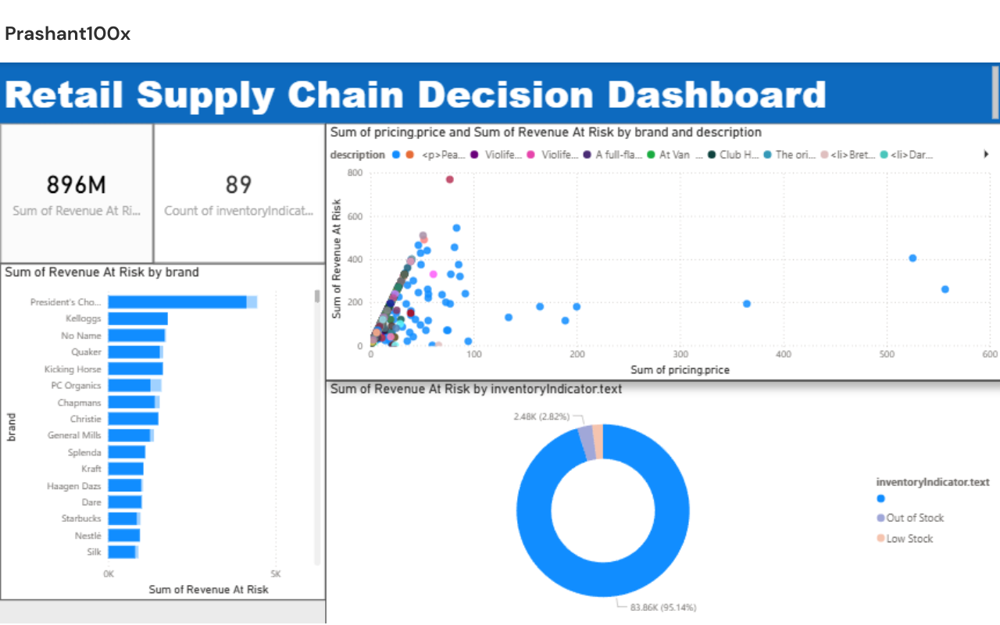

# Retail Supply Chain Decision Dashboard

## 📌 Project Objective
This project analyzes inventory availability in Canadian grocery retail stores and estimates revenue risk caused due to stock shortages.

The objective is to support supply chain managers in identifying products requiring immediate reorder to prevent revenue loss.

---

## 🧰 Tools Used
- Microsoft Excel
- Power BI

---

## 📊 Dashboard Features
- Estimated Revenue Loss KPI
- Brand Contribution to Revenue Risk
- Inventory Availability Analysis
- Price Impact on Revenue Loss
- Reorder Decision Panel

---

## 📈 Business Outcome
Helps supply chain managers make proactive reorder decisions by identifying products that contribute to revenue risk.

---

## 📷 Dashboard Preview

